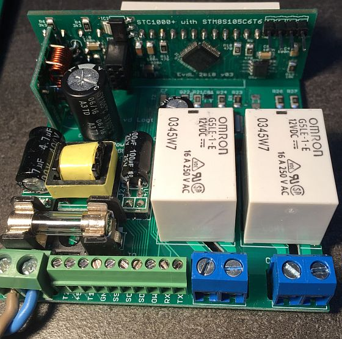

STC-1000p on steroids
==========

This is a version of the STC-1000p (STC-1000p-STM8) with new hardware and a new microcontroller, the **STM8S105C6T6**. It is a major upgrade to the stock **STM8S003F3** µC. In the version, you get all the exciting features from
the stc-1000p-stm8 version (including the PID-control with SSR output), PLUS:
- Three additional LEDs placed directly above the 7-segment display. These can be used for all kinds of indications.
- One-wire interface, so you can hook up a **DS18B20** One-Wire temperature-sensor for reliable temperature measurements.
- **I2C**-interface for additional connection to other hardware (e.g. a MCP23017 16-bit IO expander to control solenoid ball valves).
- An **UART** interface so that commands can be sent using serial communication.
- A **433 MHz** transmitter interface is added so that temperatures and relay on/off are sent (using the Fine Offset protocol from Matts original fimware).
- Interface for an **nRF24L01+** 2.4 GHz transceiver. Now you can control and communicate wireless with the STC1000p. The nRF24L01+ is known to have a large range (up to 100 metres is reported).

The **STM8S105C6T6** µC has 32 Kbytes of Flash memory, 1024 bytes of EEPROM and 2 Kbytes of RAM. So there's plenty of room for all new functionality. It also has more than sufficient IO pins, since it is a LQFP48 package.

I designed a new frontpanel PCB and backplane PCB that are the exact same sizes as the current PCBs. So it fits the existing housing.

Software Development Environment
-----------
- Cosmic STM8 compiler. A license can be obtained free of charge from Cosmic-software.com. Install this first.
- ST Visual Develop (STVD). This can be obtained free of charge from st.com
- A coloured ST-Link V2 USB adapter (which are very cheap to find on ebay)

In order to program this thing, you can't have a code-size limit of 8 Kbytes, so IAR will not do the job. Fortunately, the Cosmic STM8 development environment (IdeaSTM8) has been made available free-of-charge. Just register and download and you have 
a development environment that nicely supports this device.

Quick start
-----------
Assuming that you have bought (at least) one of those existing stc1000 on ebay/aliexpress, you need to do the following:
- Open the housing of the stc1000. There are a few clips on the side and you should make a cut in the sticker. Bend the clips (carefully) and pull the frontpanel out.
- The frontpanel PCB needs to be deconnected from the backplane. Remove all the solder-joints with the solder wick (or use a desoldering-iron). Place the solder wick over the solder-joints, heat it up with the soldering iron and make sure that the solder wick absorbs all solder.
After having done this, it is possible to remove the frontpanel from the backplane with just a little bit of pulling. Be careful, since you don't want to break anything.
- The 7-segment display is connected to the frontpanel with 12 pins and is going to be re-used. It is an essential part, so de-solder this from the frontpanel PCB. Be careful not to break anything.
- If you wish, you can desolder a few parts from the backplane PCB, such as terminal blocks and relays. I replaced the stock relays with 16 A versions (Omron G5LE-1-E 12VDC).
- Get yourself some PCBs (see below) and do some soldering...

 
*This is how it should look: frontpanel v03 connected to new backplane PCB*

Introduction
--------------
Much of this project is still work in progress, with hardware already pretty stable. The basic software from the stc1000p project runs, but most additional features mentioned above need to be added to the firmware.

I work on this from time to time, so it is not a completely finished project yet.

UART Communication protocol
--------------
If you connect an UART (+3.3V!) to USB device, it is possible to communicate with the stc1000 using commands. Currently the following commands are available:
- **S0**: print the current revision number of the software
- **S1**: Lists the address of all connected I2C devices. It should show at least 0x40, which is the I2C address for the DS2482 I2C to One-Wire device.
- **S2**: Lists all tasks of the scheduler. It should show 4 tasks.
- **S3**: Shows the temperature and status of a connected DS18B20 One-Wire device. It should read ds18b20_read():0 (1 = error) and the actual temperature of the sensor
- **O1** and **O0**: the O1 commands selects the One-wire temperature sensor over the default NTC sensor. The O0 command selects the default NTC sensor again. The selected sensorvalue is displayed on-screen and is used for both temperature and pid-control.

 
*Serial (UART) to USB interface*

Frontpanel PCB
----------
Here's version 03 of the new frontpanel PCB.

 
*Eagle schematics v03 of the Frontpanel with an STM8S105C6 µC*

 
*Eagle PCB of the Frontpanel, v03*

 
*PCB as received from the PCB manufacturer (allpcb.com).*

Backplane PCB
----------
Although it is possible to connect the frontpanel PCB directly to an existing backplane, it is much more useful to replace this with a new backplane. Main advantage is that you will have decent access to all new features via connectors at the back.

 
*Eagle schematics of the new backplane*

 
*Eagle PCB of the new backplane*

 
*PCB as received from the PCB manufacturer (allpcb.com).*

There's now a 10 pole terminal-block with the following connections:
- **T2**: connect a 2nd temperature sensor to this pin and the +3.3V pin (same as in Matts' firmware)
- **+5V**: +5V power-supply voltage (same as in original STC1000). **BUG**: this should be 3.3V.
- **T1**: connect a temperature sensor (10 k NTC) to this pin and the +5V pin (same as in original STC1000)
- **GND**: ground (0 V) connection. 
- **SSR**: SSR output. Connect this to the input line of a solid-state relay. This is a PID controlled output.
- **SCL**: Serial clock-line of the I2C interface.
- **SDA**: Serial data-line of the I2C interface.
- **OW**: One-wire output. Support a DS18B20 temperature sensor for more accurate readings.
- **RX**: Receive-data pin for the serial communication (UART). This is a 3.3 Volt pin, so do not connect higher voltages!
- **TX**: Transmit-data pin for the serial communication (UART). This is a 3.3 Volt pin, so do not connect higher voltages!

Updates
-------

|Date|Release|Description|
|----|-------|-----------|
|2016-12-10|v1.00|First release |
|2018-03-23|v1.10|Frontpanel PCB update + new backplane PCB added|
|2019-01-07|v1.10|First working version with UART, One-Wire and Fine-Offset Protocol (433 MHz) added|

