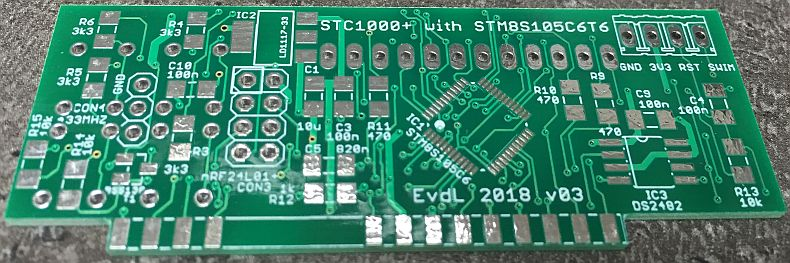

STC-1000p on steroids
==========

This is a version of the STC-1000p (STC-1000p-STM8) with new hardware and a new microcontroller, the **STM8S105C6T6**. It is a major upgrade to the stock **STM8S003F3** µC. In the version, you get all the exciting features from
the stc-1000p-stm8 version (including the PID-control with SSR output), PLUS:
- Three additional LEDs placed directly above the 7-segment display. These can be used for all kinds of indications.
- Interface for an **nRF24L01+** 2.4 GHz transceiver. Now you can control and communicate wireless with the STC1000p. The nRF24L01+ is known to have a large range (up to 100 metres is reported).
- One-wire interface, so you can hook up a **DS18B20** One-Wire temperature-sensor for reliable temperature measurements.
- **I2C**-interface for additional connection to other hardware (e.g. a MCP23017 16-bit IO expander to control solenoid ball valves).
- Two additional IO lines called IO1 and IO2. One option could be to have a second pid-control / SSR-output (or even a third...). Or use it to control two pumps.

The **STM8S105C6T6** µC has 32 Kbytes of Flash memory, 1024 bytes of EEPROM and 2 Kbytes of RAM. So there's plenty of room for all new functionality. It also has more than sufficient IO pins, since it is a LQFP48 package.

I designed a new frontpanel PCB that is the exact same size as the current frontpanel PCB. So it fits the housing and connects easily to the backplane PCB.

In order to program this thing, you can't have a code-size limit of 8 Kbytes, so IAR will not do the job. Fortunately, the Cosmic STM8 development environment (IdeaSTM8) has been made available free-of-charge. Just register and download and you have 
a development environment that nicely supports this device.

Quick start
-----------
To be filled in...

Introduction
--------------
To be filled in...

Frontpanel PCB
----------
Here's the first version of the new frontpanel PCB.

 
*Eagle schematic of the Frontpanel with an STM8S105C6 µC*

 
*Eagle PCB of the Frontpanel, v01*

 
*PCBs as received from the PCB manufacturer.*

Backplane PCB
----------
Although you can connect the frontpanel PCB directly to an existing backplane, it is much more fun to replace this with a new backplane. Main advantage is that you will have decent access to all new features via connectors at the back.

Current status: the design has to be made yet.

Updates
-------

|Date|Release|Description|
|----|-------|-----------|
|2016-12-10|v1.00|First release |

